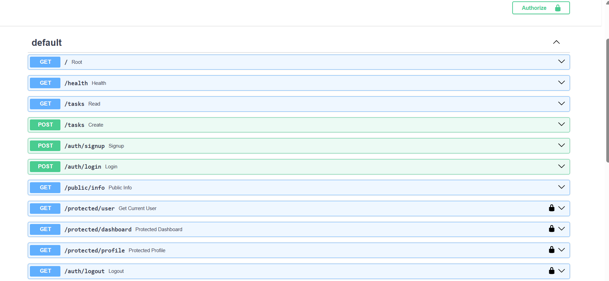
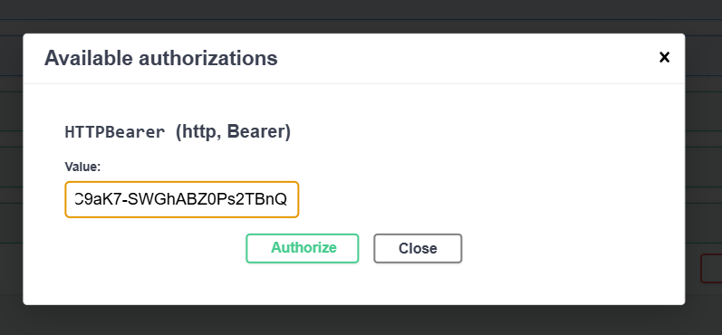
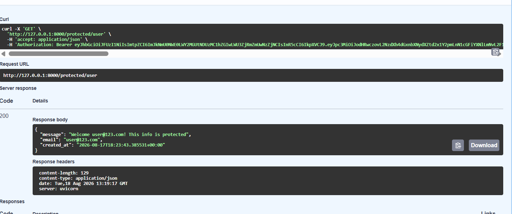

# crud_database__api_now_with_authentication

# Task API — Supabase Authentication

A FastAPI task management API with **Supabase Authentication**, JWT verification, protected routes, and Swagger UI documentation.

## Tech Stack

* Python
* FastAPI
* Supabase Auth
* SQLAlchemy
* SQLite
* Pydantic
* JWT / Bearer Authentication

## Features

### Authentication

* **Sign Up** — `POST /auth/signup`
* **Login** — `POST /auth/login`
* **Logout** — `POST /auth/logout`
* Supabase handles user accounts, password hashing, and JWT generation.
* Access tokens are verified before protected resources are accessed.

### Routes

| Method | Endpoint              | Access    |
| ------ | --------------------- | --------- |
| POST   | `/auth/signup`        | Public    |
| POST   | `/auth/login`         | Public    |
| POST   | `/auth/logout`        | Protected |
| GET    | `/public/info`        | Public    |
| GET    | `/protected/profile`  | Protected |
| GET    | `/protected/dashboard`| Protected |

Protected routes require:

```text
Authorization: Bearer <access_token>
```

Invalid, expired, missing, or malformed tokens return `401 Unauthorized`.

## Authentication Flow

```text
Sign Up / Login
       ↓
  Supabase Auth
       ↓
   JWT Access Token
       ↓
 Authorization Header
       ↓
 FastAPI Auth Dependency
       ↓
 Supabase Token Verification
       ↓
 Protected Resource
```

The authentication logic is handled through a reusable FastAPI dependency so the same guard can be applied to multiple protected routes.

## Swagger UI

FastAPI provides interactive API documentation at:

```text
http://localhost:8000/docs
```

The Swagger UI supports Bearer authentication through the **Authorize** button.

## Environment Variables

Create a `.env` file:

```env
SUPABASE_URL=your_project_url
SUPABASE_KEY=your_anon_key
```

The `.env` file must remain in `.gitignore` and should never be pushed to GitHub.

## Running the API

Start the FastAPI server and open:

```text
http://localhost:8000/docs
```

# Screenshots
## All the protected and logout routes



## Token the Authorization tool within the lock icon



## The protected route using the same token to verrify the user's profile using our get_current_user method




## Outcome

A secure FastAPI API with Supabase-based authentication, JWT verification, reusable protected-route authentication, logout, and interactive Swagger documentation.


# AI Rematch Part

## My Prompt

`Add supabase authentication system with auth endpints login and logout and protected routes, but a middle ware fucntion whcih checks the logged in user's identity before welcome them to profile and dashboard. Implement checks within this fucntion to make sure the token created has the startswith bearer, then authenticate the token itself, using the relevant supabase function for python, and use fastapi's security`

## Findings
Majority of the code is similar, I did provide context using the eariler AI generated code from week 1's CRUD. AI does use more newer implementation of error handling as compared to me. Instead of Creating one pydantic Auth model like I did, it has used two separate schemas one for signup and one for login. This is the only one major change. Authenitication in the middleware is relatively similar to mine. 

## Improvements
Here my code could use some improvements when it comes to error handling. Another point, similar  prompts creates much different code based on the AI being used. Deepseek relatively gave a much more detailed and extra code, as compared to Gemini, the one the in AI_code.py file.


